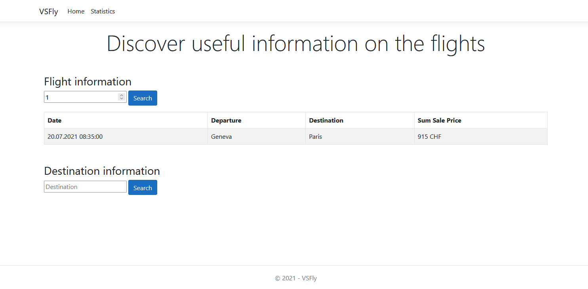

<h1 align="center">
   ValaisBooking 
</h1>

    <strong>A flight booking website where you can find and book the best flights for your holidays !</strong>

    

 

The VSFly project was made to get familiar with setting up a REST API in C# and use it in real conditions.

This website has **NOT** the ambition to reach the production stage. It was created for the sole purpose of training.

## Table of Contents

1. [Getting Started](#getting-started)
2. [API Endpoints](#api-endpoints)
3. [Authors](#authors)
4. [Guides and resources](#guides-and-resources)
5. [License](#license)

## Getting Started

### Launching the website

The project contains two different solutions :
1. **VSFlyAPI** (contains the DB and the API endpoints)
2. **VSFlyWebsite** (the client that uses the API)

Before using the website, ensure that you have everything set up correctly following these simple steps :
1. Open the solution (`EFCoreApp2021.sln` file) in a code editor that supports the C# language _**(I strongly recommend Visual Studio)**_.
2. Run once the `EFCoreApp2021` project contained in the _EFCoreApp2021_ solution in order to create and initialize the local database with flights samples. See more about what data is inserted in DB in the [Sample data section](#sample-data).
3. Launch the API by running the `VSFlyAPI` project contained in the _EFCoreApp2021_ solution. It will allow the VSFlyWebsite to interact with the DB using the API.
4. Open the solution (`VSFlyWebsite.sln` file) and launch the `VSFlyWebsite` project contained in the _VSFlyWebsite_ solution. The website will automatically open in your browser. _Make sure to keep the API running while you use the website, otherwise the website will not be able to retrieve any data._
5. Voilà ! 🎉 You now have the VSFly website and API that are running locally.

### Sample data

The data initialized in the _Launching the website_ tutorial is stored in a database called **WWWings_2021** that is created locally in the SQL Server MSSQLLocalDB.

The following tables are created :
- BookingSet
- FlightSet
- PassengerSet
- PilotSet

The sample data stored the first time you launch the `EFCoreApp2021` project only concerns the _FlightSet_ table and is the following :

| FlightNo | Departure  | Destination | Date  |  BasePrice |  Seats |  PilotId |
| --- | ----- | ------- | ------------------- | --- | ----- | -------- |
| 1  | Geneva |  Paris	| 20.07.2021 08:35:00 |	150 |   6	| 1 |
| 2  | Paris |   Zurich	| 22.07.2021 17:40:00 |	180 |   10	| 1 |
| 3  | London |  Basel	| 23.07.2021 18:40:00 |	90 |    6	| 2 |
| 4  | London |  Basel	| 28.07.2021 09:55:00 |	75 |    10	| 3 |
| 5  | Geneva |  Paris	| 22.09.2021 10:40:00 |	200 |   10	| 3 |

## API Endpoints

### Bookings

- GET /api/Bookings
> Return all bookings.

- POST /api/Bookings
> Add a new entry into BookingSet.

- GET /api/Bookings/{flightNo}/SalePrice
> Return the sum of all booking prices paid for a given flight.

- GET /api/Bookings/Destination/{destination}
> Return all the booking information about a given destination.

- GET /api/Bookings/Destination/{destination}/AveragePrice
> Return the average price paid for a given destination.

### Flights

- GET /api/Flights/Available
> Return the available flights (= the bookable flights)

- GET /api/Flights/{id}
> Return the flight for the given flight id.

- GET /api/Flights/{id}/SalePrice
> Return the booking price of the flight for the given flight id.

## Authors

<table>
   <tbody>
      <tr>
         <td align="center" valign="top" width="11%">
            <a href="https://github.com/d-roduit">
             
            Daniel Roduit
            </a>
         </td>
         <td align="center" valign="top" width="11%">
            <a href="https://gitlab.com/Henrick_Neads">
             
            Henrick Neads
            </a>
         </td>
      </tr>
   </tbody>
</table>

## Guides and resources

* [ASP.NET Core](https://docs.microsoft.com/en-us/aspnet/core/) - ASP.NET Core Documentation

## License

This project is licensed under the MIT License
